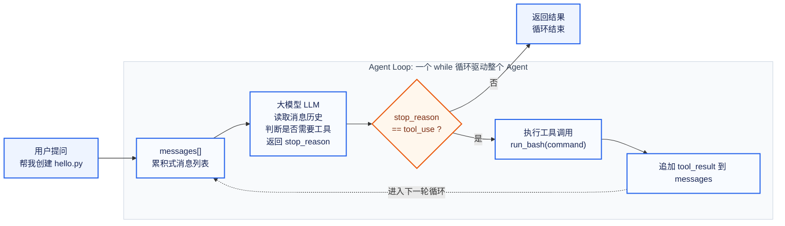
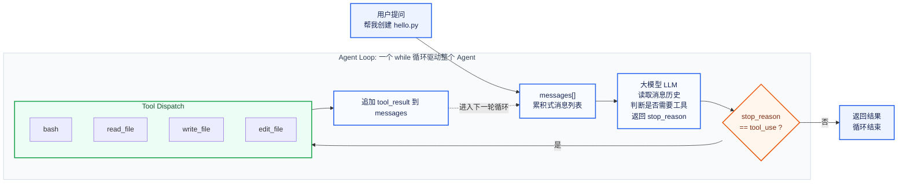

# 学习路径
看文档->自己复述总结一遍->绘制架构图->重写()->AI review->开源实现
# 笔记
## Agent loop
### 架构图

核心：一个 `while True` 循环里，模型判断要不要调用工具；如果要，就执行工具并把 `tool_result` 放回 `messages`，再进入下一轮；如果不要，就返回最终结果。

## Tool Use
### 架构图

核心：将bash工具扩展到4个工具的工具集